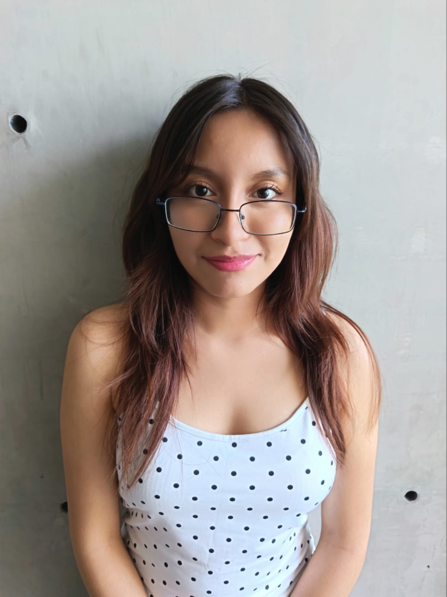
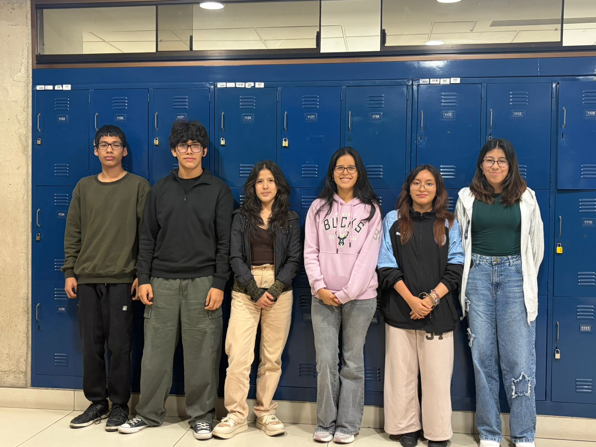

# 💡 EQUIPO 05 – PROCESOS DE INNOVACIÓN

<p align="center">
  <b>Repositorio del Equipo 05</b><br>
  Curso de Procesos de Innovación
</p>

---

## 📌 Bienvenidos

Bienvenidos al repositorio del **Equipo 05 del curso de Procesos de Innovación**.

Este repositorio tiene como finalidad organizar, documentar y almacenar los diferentes archivos, recursos y avances desarrollados por nuestro equipo a lo largo del curso.

Actualmente, el equipo se encuentra en una etapa inicial de organización. Conforme avance el curso, se incorporará la información correspondiente al proyecto, documentación, recursos de hardware, software e imágenes.

---

# 📑 Tabla de Contenidos

1. [Integrantes del Equipo](#-integrantes-del-equipo)
2. [Nuestro Equipo](#-nuestro-equipo)
3. [Información del Proyecto](#-información-del-proyecto)
4. [Estructura del Repositorio](#-estructura-del-repositorio)
5. [Documentación](#-documentación)
6. [Hardware](#-hardware)
7. [Software](#-software)
8. [Imágenes](#-imágenes)
9. [Lenguajes y Herramientas](#-lenguajes-y-herramientas)
10. [Estado del Proyecto](#-estado-del-proyecto)

---

# 👥 Integrantes del Equipo

<table>
  <tr>
    <th align="center">Foto</th>
    <th align="center">Nombre</th>
    <th align="center">Rol</th>
    <th align="center">Intereses</th>
  </tr>

  <tr>
    <td align="center">
      
    </td>
    <td>
      <b>Arelys Keith De La Cruz Rixe</b>
    </td>
    <td align="center">
      Por definir
    </td>
    <td align="center">
      Por definir
    </td>
  </tr>

  <tr>
    <td align="center">
      
    </td>
    <td>
      <b>Dannae Rafaella Cardenas Arana</b>
    </td>
    <td align="center">
      Por definir
    </td>
    <td align="center">
      Por definir
    </td>
  </tr>

  <tr>
    <td align="center">
      
    </td>
    <td>
      <b>Oriana Ingrid Chavez Carrillo</b>
    </td>
    <td align="center">
      Por definir
    </td>
    <td align="center">
      Por definir
    </td>
  </tr>

  <tr>
    <td align="center">
      
    </td>
    <td>
      <b>Thiago Josue Huaman Fernandez</b>
    </td>
    <td align="center">
      Por definir
    </td>
    <td align="center">
      Por definir
    </td>
  </tr>

  <tr>
    <td align="center">
      
    </td>
    <td>
      <b>Gabriel Jesus Salazar Moquillaza</b>
    </td>
    <td align="center">
      Por definir
    </td>
    <td align="center">
      Por definir
    </td>
  </tr>

  <tr>
    <td align="center">
      
    </td>
    <td>
      <b>Daniela Alejandra Guanilo Cherre</b>
    </td>
    <td align="center">
      Por definir
    </td>
    <td align="center">
      Por definir
    </td>
  </tr>

</table>

> 📌 **Nota:** Las fotografías mostradas actualmente son imágenes provisionales. Serán reemplazadas posteriormente por las fotografías de cada integrante.

---

# 📸 Nuestro Equipo

<p align="center">
  <b>FOTO GRUPAL</b>
</p>

<p align="center">
  
</p>

<p align="center">
  👥 <b>Equipo 05 – Procesos de Innovación</b>
</p>

---

# 💡 Información del Proyecto

### Nombre del proyecto

**Por definir.**

### Descripción

El proyecto del **Equipo 05** se encuentra actualmente en proceso de definición.

Esta sección será actualizada conforme avance el curso e incluirá la información principal relacionada con el proyecto desarrollado por el equipo.

### Objetivo general

**Por definir.**

### Objetivos específicos

**Por definir.**

### Problemática

**Por definir.**

### Propuesta de solución

**Por definir.**

---

# 📂 Estructura del Repositorio

El repositorio se encuentra organizado en diferentes carpetas con la finalidad de mantener ordenados los archivos y recursos utilizados durante el desarrollo del proyecto.

La estructura general es la siguiente:

```text
EQUIPO-05-PROCESOS-DE-INNOVACION/
│
├── 📁 Documentación/
│
├── 📁 Hardware/
│
├── 📁 Imágenes/
│   └── Imagen de referencia.png
│
├── 📁 Software/
│
└── 📄 README.md
```

Cada carpeta será actualizada conforme avance el desarrollo del proyecto.

---

# 📄 Documentación

📁 `Documentación/`

Esta carpeta estará destinada a almacenar los diferentes documentos generados durante el desarrollo del proyecto.

Entre ellos podrán encontrarse:

* Informes.
* Investigaciones.
* Presentaciones.
* Artículos y fuentes de consulta.
* Diagramas.
* Documentos de planificación.
* Avances del proyecto.
* Entregables del curso.

El contenido de esta carpeta será actualizado progresivamente.

---

# 🔧 Hardware

📁 `Hardware/`

Esta carpeta estará destinada a almacenar la información relacionada con los componentes físicos utilizados en el proyecto.

Podrá contener información sobre:

* Componentes electrónicos.
* Sensores.
* Microcontroladores.
* Dispositivos.
* Materiales.
* Diagramas de conexión.
* Esquemáticos.
* Fichas técnicas.
* Diseños de prototipos.

> Actualmente, el hardware que será utilizado se encuentra **por definir**.

---

# 💻 Software

📁 `Software/`

Esta carpeta estará destinada a almacenar todos los archivos relacionados con el desarrollo de software del proyecto.

Podrá incluir:

* Código fuente.
* Algoritmos.
* Programas.
* Simulaciones.
* Interfaces.
* Pruebas.
* Archivos de configuración.
* Documentación del código.

> Actualmente, las herramientas de software específicas se encuentran **por definir**.

---

# 🖼️ Imágenes

📁 `Imágenes/`

Esta carpeta contiene los diferentes recursos gráficos utilizados en la documentación del repositorio.

Actualmente contiene:

* Imagen provisional para representar a los integrantes del equipo.

Posteriormente se añadirán:

* Fotografías individuales de los integrantes.
* Fotografía grupal.
* Imágenes relacionadas con el proyecto.
* Diagramas.
* Fotografías del proceso de desarrollo.
* Fotografías del prototipo.

---

# 🛠️ Lenguajes y Herramientas

Las herramientas, plataformas y lenguajes de programación utilizados durante el proyecto serán registrados en esta sección.

### Lenguaje de programación

⌛ **Por definir**

### Software utilizado

⌛ **Por definir**

### Hardware utilizado

⌛ **Por definir**

### Control de versiones

* **Git**

### Repositorio y colaboración

* **GitHub**

---

# 🤝 Colaboración

El repositorio será utilizado como espacio de trabajo colaborativo para los integrantes del **Equipo 05**.

Git y GitHub permitirán registrar y organizar los diferentes cambios realizados durante el desarrollo del proyecto.

Para mantener actualizado el repositorio se utilizarán comandos como:

```bash
git status
git add .
git commit -m "Descripción del cambio"
git push
```

Antes de realizar nuevos cambios también se podrá actualizar el repositorio local mediante:

```bash
git pull origin main
```

---

# 🚧 Estado del Proyecto

### Estado actual

🟡 **Etapa inicial – Organización del equipo**

Actualmente estamos trabajando en:

* Organización del repositorio.
* Configuración de Git y GitHub.
* Registro de los integrantes.
* Organización de carpetas.
* Preparación de la documentación inicial.
* Definición del proyecto.

### Próximamente

Se incorporará:

* ✅ Fotografías individuales de los integrantes.
* ✅ Fotografía grupal.
* 💡 Nombre del proyecto.
* 🎯 Objetivos.
* 🔎 Problemática.
* 🛠️ Propuesta de solución.
* 🔧 Hardware utilizado.
* 💻 Software utilizado.
* 📄 Documentación del proyecto.
* 📊 Resultados y avances.

---

# 📚 Curso

**Curso:** Procesos de Innovación
**Equipo:** Equipo 05
**Año:** 2026

---

<p align="center">
  <b>💡 EQUIPO 05 – PROCESOS DE INNOVACIÓN 💡</b>
</p>

<p align="center">
  Repositorio desarrollado colaborativamente por los integrantes del Equipo 04.
</p>

